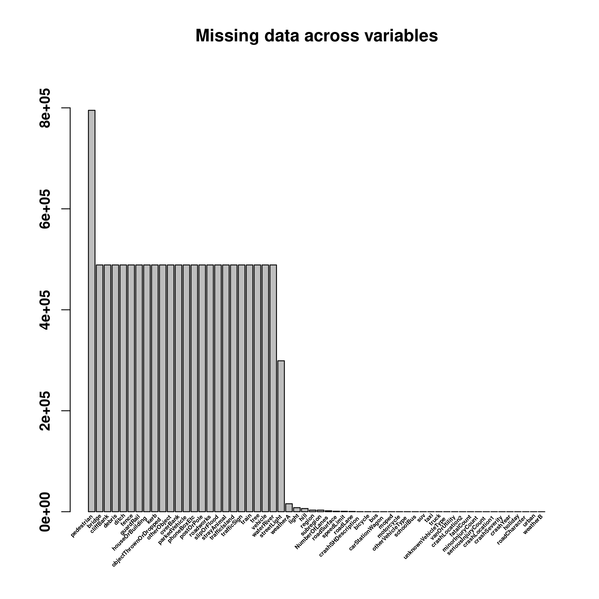

## Introduction

This is an Exploratory Data Analysis (EDA) for New Zealand Crash data.
The aim of EDA is to explore data, find interesting patterns, and generate set of hypothesis that are worth to explore further, but also to find inconsistencies, coding errors, duplications and so on.
For this reason, EDA is often the first step that needs to be done when looking at new data before other statistical or machine learning approaches are used. Ideally, EDA will be done in collaboration with a domain expert as many of the patterns or inconsistencies can be just a property of the data, be it from the way the data was collected, or expected patterns based on the mechanism that generate the data. Since these kind of patterns might influence the model-fitting and hypothesis testing steps later in the analysis, identifying these patterns and working with domain expert is an important step to get aware of these patterns so that they do not influence steps later and do not produce false positive relationships, or mask the true ones.

EDA is not a hard science, but more of an art, and there are no hard rules. While some tools for automatic EDA exist, see [The Landscape of R Packages for Automated Exploratory Data Analysis](https://arxiv.org/pdf/1904.02101.pdf) for review, EDA is in its essence interactive. You are going through data, looking at various data points, features, and patterns, and searching for interesting questions and answers.

The history of EDA is interesting and its modern history starts with Tukey, but in truth, any data analysis starts with looking at patterns in the data and in truth, EDA is as old as statistics, and perhaps even predates it. After all, this is how Bayes came with, and Laplace rediscovered the Bayesian theorem, or how various probability distributions were invented/discovered. For a good review on statistics data science, and EDA, see [50 years of Data Science](https://www.tandfonline.com/doi/full/10.1080/10618600.2017.1384734). Or you can go directly for the [Future of Data Analysis](https://web.stanford.edu/~gavish/documents/Tukey_the_future_of_data_analysis.pdf) from Tukey written in 1961.  For a good tutorial for EDA, the [R for Data Science](https://r4ds.had.co.nz/exploratory-data-analysis.html#exploratory-data-analysis) from Hadley is a great source.

## About this work
This work was done as a part of interview for the Data Analyst position with New Zealand Ministry of Transport and got me an offer. The task was to look at geographical patterns, but since this is my first time working with the data, I think that EDA is a must to familiarize oneself with the data and how the data are coded, because interpretation of the patterns will strongly depend on this.

All the code as well as a version of this document is available on [my github](http://github.com/j-moravec/CrashDataEda). The crash data is quite large, so I didn't include a copy of it here, but I did include copy of some population data we will use for normalization later.

## EDA: NZ Crash Data
The purpose of this analysis is to explore New Zealand crash statistics data, and create insight on crashes by region, or other spatial area. And if we find some interesting relationship, we might try to do some little non-serious modelling. Why non-serious? Because we need domain expert to discuss the data with us, but we do not have a domain expert. Because of that, we do not know what are the limitations and assumptions in the data, so any modelling done in here is purely exploratory.

As pointed by the previous paragraph, there are some limitations. The challenge here is to do this in a limited time, so we will be able to do only very cursory exploration and look only at some overall patterns in the data, we won't be going much into detail both by looking at year to year differences in various statistics, or by looking closely at small geographical areas, such as spikes in the city centres and so on. We also do not have a domain expert on hand, so we can't discuss various findings, which means we do not know if any pattern we see is a true pattern, or just something resulting from the way the data way collected/encoded. This will be obvious quite later.

Finally, as this is exploratory analysis, do not expect high quality infographics. Quick and dirty graphs are what we are looking for. In fact, in some some cases, I prefer to not even look at graphs, instead look at distribution of numbers. Good graphs take a time to setup, and sometimes might hide some obvious issues with the data. For instance, boxplots are great for visualising basic statistics, but it hides how the data are distributed inside the box, for instance, perfectly clean boxplot might not show a bimodal distribution of data.

### Downloading the data

To get the data, we download the CSV from [https://opendata-nzta.opendata.arcgis.com](https://opendata-nzta.opendata.arcgis.com/datasets/NZTA::crash-analysis-system-cas-data-1/about).

I downloaded a table updated on `6th July 2023`, and there are `821 744` records.
Unfortunately, there is no way how to provide a direct link to download the data, as this is hidden behind javascript action. There is a ArcGIS REST API, but it is not documented at this page, and even the [main documentation](https://developers.arcgis.com/documentation/mapping-apis-and-services/data-hosting/services/feature-service/), once you figure out that you are looking for `Feature Service`, is less than ideal.

Given enough time, this could be figured out, but by default, only `2000` records are downloaded, and since we are pressed for time, I chose to not explore this further. Last time I worked with a similar API (GenBank), there was a hard limit on how many records could be downloaded at once. To download everything, one had to split the query into multiple subqueries and collate the result. To do this right, I would need to either use or write a package to provide binding for these queries and this would take quite a bit of time. It is possible to do this without package, but [it might get quite a bit difficult](https://community.esri.com/t5/gis-life-blog/accessing-arcgis-rest-services-using-r/ba-p/898451) and error-prone.

### Basic data cleaning and exploration

I downloaded the data into the `data` folder, so we can start looking at it and doing some basic cleaning.

```r
filename = "data/Crash_Analysis_System_(CAS)_data.csv"
data = read.csv(filename)

names(data)
```

```
##  [1] "X"                         "Y"                        
##  [3] "OBJECTID"                  "advisorySpeed"            
##  [5] "areaUnitID"                "bicycle"                  
##  [7] "bridge"                    "bus"                      
##  [9] "carStationWagon"           "cliffBank"                
## [11] "crashDirectionDescription" "crashFinancialYear"       
## [13] "crashLocation1"            "crashLocation2"           
## [15] "crashRoadSideRoad"         "crashSeverity"            
## [17] "crashSHDescription"        "crashYear"                
## [19] "debris"                    "directionRoleDescription" 
## [21] "ditch"                     "fatalCount"               
## [23] "fence"                     "flatHill"                 
## [25] "guardRail"                 "holiday"                  
## [27] "houseOrBuilding"           "intersection"             
## [29] "kerb"                      "light"                    
## [31] "meshblockId"               "minorInjuryCount"         
## [33] "moped"                     "motorcycle"               
## [35] "NumberOfLanes"             "objectThrownOrDropped"    
## [37] "otherObject"               "otherVehicleType"         
## [39] "overBank"                  "parkedVehicle"            
## [41] "pedestrian"                "phoneBoxEtc"              
## [43] "postOrPole"                "region"                   
## [45] "roadCharacter"             "roadLane"                 
## [47] "roadSurface"               "roadworks"                
## [49] "schoolBus"                 "seriousInjuryCount"       
## [51] "slipOrFlood"               "speedLimit"               
## [53] "strayAnimal"               "streetLight"              
## [55] "suv"                       "taxi"                     
## [57] "temporarySpeedLimit"       "tlaId"                    
## [59] "tlaName"                   "trafficControl"           
## [61] "trafficIsland"             "trafficSign"              
## [63] "train"                     "tree"                     
## [65] "truck"                     "unknownVehicleType"       
## [67] "urban"                     "vanOrUtility"             
## [69] "vehicle"                   "waterRiver"               
## [71] "weatherA"                  "weatherB"
```

There is quite lot of features in here. One big issue with this dataset is that there is a complete lack of description _what these features mean_. Previously, I worked with [Ethnographic Atlas](https://d-place.org/contributions/EA), and there is a whole [codebook](https://github.com/J-Moravec/clustering_ethnographic_atlas/blob/master/data) on the meaning of individual features and the way they were coded. IMHO, this is quite an issue that should be corrected and something that could be easily resolved if we had an expert on hand.

For instance, what is `advisorySpeed`? Advised speed lower than maximum allowed speed that is put in tight corners? That would make sense. But look at what happens when we create a contingency table (bivariate relationship) of `advisorySpeed` and `speedLimit`, which I assume is the maximum allowed speed:


```r
table("Speed Limit"=data$speedLimit, "Advisory Speed"=data$advisorySpeed, useNA="always")
```

```
##            Advisory Speed
## Speed Limit     15     20     25     30     35     40     45     50     55
##        2         0      0      0      0      0      0      0      0      0
##        5         0      0      0      0      0      0      0      0      0
##        6         0      0      0      0      0      0      0      0      0
##        10        0      0      0      0      0      0      0      0      0
##        15        0      0      0      0      0      0      0      0      0
##        20       11      1      0      0      0      0      0      0      0
##        30       24     20     33      0      0      0      0      0      0
##        40        2      2      5      3      6      0      0      1      0
##        50      172    353    637    915   1220    498   1254      7      2
##        51        0      0      0      0      0      0      0      0      0
##        60        6      1     25     11     99     11    120     27    119
##        61        0      0      0      0      0      0      0      0      0
##        70        4      7     70     29    224     20    201    102    207
##        80        6      8    101     35    444      8    463     83    598
##        90        0      0      0      0      0      0      3      0      1
##        100      65     27    658    315   2053     88   2802    421   3750
##        110       0      0      0      0      2      0      1      0      0
##        <NA>      0      0      0      0      0      0      0      0      0
##            Advisory Speed
## Speed Limit     60     65     70     75     80     85     90     95   <NA>
##        2         0      0      0      0      0      0      0      0      1
##        5         0      0      0      0      0      0      0      0     15
##        6         0      0      0      0      0      0      0      0      1
##        10        0      0      0      0      0      0      0      0    813
##        15        0      0      0      0      0      0      0      0     10
##        20        0      0      0      0      0      0      0      0   1934
##        30        0      0      0      0      0      0      0      0   7261
##        40        0      0      0      0      0      0      0      0   1800
##        50        0      1      0      2      0      0      0      0 488142
##        51        0      0      0      0      0      0      0      0      1
##        60        1      3      0      1      0      0      0      0  22471
##        61        0      0      0      0      0      0      0      0      1
##        70       29    200      1      1      0      1      0      0  24372
##        80       41    488     60    255      0      0      0      0  37847
##        90        0      0      0      4      1      3      0      0    465
##        100     213   4556    501   3684    675   1798    153    289 204254
##        110       0      1      0      0      0      0      0      1    174
##        <NA>      0      0      0      0      0      0      0      0    838
```
Advisory Speed is usually bellow the Speed Limit, as expected, but I would expect that Advisory Speed is _always_ bellow the Speed Limit. In some cases, this is not true. Are the assumptions we made about the meaning of both variables correct? If so, does that mean that there is a codding error? Or something else is happening, such as incorrect signage on road?

For instance, we could easily subset some of the strange datapoints, for instance, where Speed Limit is `50`, and Advisory Speed is larger than that:

```r
subset(data, data$speedLimit == 50 & data$advisorySpeed > 50)
```

```
##              X       Y OBJECTID advisorySpeed areaUnitID bicycle bridge bus
## 98658  1823770 5537280   160173            75     561811       0      0   0
## 192652 1819785 5576514   316844            65     558700       0     NA   0
## 295973 1572148 5170547   480920            55     596400       0      0   0
## 517292 1751258 5950941   822065            55     505805       0     NA   0
## 721471 1571780 5170316  1158036            75     596503       0      0   0
##        carStationWagon cliffBank crashDirectionDescription crashFinancialYear
## 98658                1         0                     South          2020/2021
## 192652               1        NA                      West          2018/2019
## 295973               0         0                     North          2018/2019
## 517292               2        NA                     South          2021/2022
## 721471               1         1                      East          2020/2021
##                crashLocation1     crashLocation2 crashRoadSideRoad
## 98658            RAILWAY ROAD       MAPLE STREET                NA
## 192652               01N-0885    KOTUKUTUKU ROAD                NA
## 295973     GOVERNORS BAY ROAD   SANDY BEACH ROAD                NA
## 517292 HIBISCUS COAST HIGHWAY           GRUTS BR                NA
## 721471        DYERS PASS ROAD GOVERNORS BAY ROAD                NA
##           crashSeverity crashSHDescription crashYear debris
## 98658  Non-Injury Crash                 No      2021      0
## 192652      Minor Crash                Yes      2018     NA
## 295973 Non-Injury Crash                 No      2019      0
## 517292 Non-Injury Crash                 No      2021     NA
## 721471 Non-Injury Crash                 No      2020      0
##        directionRoleDescription ditch fatalCount fence  flatHill guardRail
## 98658                     South     0          0     0      Flat         0
## 192652                    South    NA          0    NA      Flat        NA
## 295973                    South     0          0     0 Hill Road         0
## 517292                    South    NA          0    NA Hill Road        NA
## 721471                     East     0          0     0 Hill Road         0
##        holiday houseOrBuilding intersection kerb      light meshblockId
## 98658                        0           NA    0       Dark     1792100
## 192652                      NA           NA   NA       Dark     1728600
## 295973                       0           NA    0       Dark     2711400
## 517292                      NA           NA   NA Bright sun      171102
## 721471                       0           NA    0       Dark     2711501
##        minorInjuryCount moped motorcycle NumberOfLanes objectThrownOrDropped
## 98658                 0     0          0             2                     0
## 192652                1     0          0             2                    NA
## 295973                0     0          0             2                     0
## 517292                0     0          0             2                    NA
## 721471                0     0          0             2                     0
##        otherObject otherVehicleType overBank parkedVehicle pedestrian
## 98658            0                0        0             0         NA
## 192652          NA                0       NA            NA         NA
## 295973           0                0        0             0         NA
## 517292          NA                0       NA            NA         NA
## 721471           0                0        0             0         NA
##        phoneBoxEtc postOrPole                    region roadCharacter roadLane
## 98658            0          0 Manawatū-Whanganui Region           Nil    2-way
## 192652          NA         NA Manawatū-Whanganui Region           Nil    2-way
## 295973           0          0         Canterbury Region           Nil    2-way
## 517292          NA         NA           Auckland Region           Nil    2-way
## 721471           0          0         Canterbury Region           Nil    2-way
##        roadSurface roadworks schoolBus seriousInjuryCount slipOrFlood
## 98658       Sealed         0         0                  0           0
## 192652      Sealed        NA         0                  0          NA
## 295973      Sealed         0         0                  0           0
## 517292      Sealed        NA         0                  0          NA
## 721471      Sealed         0         0                  0           0
##        speedLimit strayAnimal streetLight suv taxi temporarySpeedLimit tlaId
## 98658          50           0        None   0    0                  NA    40
## 192652         50          NA        None   0    0                  NA    38
## 295973         50           0          On   0    0                  NA    60
## 517292         50          NA        None   0    0                  NA    76
## 721471         50           0        None   0    0                  NA    60
##                      tlaName trafficControl trafficIsland trafficSign train
## 98658  Palmerston North City            Nil             0           0     0
## 192652   Rangitikei District        Unknown            NA          NA    NA
## 295973     Christchurch City        Unknown             0           0     0
## 517292              Auckland       Give way            NA          NA    NA
## 721471     Christchurch City            Nil             0           0     0
##        tree truck unknownVehicleType urban vanOrUtility vehicle waterRiver
## 98658     0     0                  0 Urban            0       0          0
## 192652   NA     0                  0 Urban            0      NA         NA
## 295973    1     0                  0 Urban            1       0          0
## 517292   NA     0                  0 Urban            0      NA         NA
## 721471    0     0                  0 Urban            0       0          0
##        weatherA    weatherB
## 98658      Fine        Null
## 192652     Fine        Null
## 295973     Fine        Null
## 517292     Fine Strong wind
## 721471     Fine        Null
```
but I don't see anything particularly wrong or strange.

Knowing this, we will start cleaning the data, and by that I mostly mean dropping variables.

For instance, we won't be working with many geographical variables, and we do not need their IDs, so we can drop `X`, `Y`, `OBJECTID`, `areaUnitID`, `meshblockId`, `crashFinancialYear`, and `tlaId`.

The `tla` stands for Territorial Local Authority, which divides regions into subregions (contained in `region` variable), so we will rename `tlaName` into `subregion` for better understandability.


```r
data[c("X", "Y", "OBJECTID", "areaUnitID", "meshblockId", "crashFinancialYear", "tlaId")] = NULL

names(data)[names(data) == "tlaName"] = "subregion"
```

There is more cleaning that we will do, but for that, we need to look at the data.
A simple `lapply(data, table)` will do most of the work, since all the data is categorical or ordinal. But doing so for 65 variables is quite a bit too much, so we will divide the features according to their type. We will start with `vehicleType` and continue with other groups such as `roadConditions`, `otherObjects` and so on.

Also, to help us in this, I define the operator `%-%` so we can see what we already defined.

```r
"%-%" = function(x,y){x[!(x %in% y)]}

vehicleType = c("bicycle", "bus", "carStationWagon", "moped", "motorcycle",
    "otherVehicleType", "parkedVehicle", "schoolBus", "suv", "taxi", "train",
    "truck", "unknownVehicleType", "vanOrUtility", "vehicle")

names(data) %-% vehicleType
```

```
##  [1] "advisorySpeed"             "bridge"                   
##  [3] "cliffBank"                 "crashDirectionDescription"
##  [5] "crashLocation1"            "crashLocation2"           
##  [7] "crashRoadSideRoad"         "crashSeverity"            
##  [9] "crashSHDescription"        "crashYear"                
## [11] "debris"                    "directionRoleDescription" 
## [13] "ditch"                     "fatalCount"               
## [15] "fence"                     "flatHill"                 
## [17] "guardRail"                 "holiday"                  
## [19] "houseOrBuilding"           "intersection"             
## [21] "kerb"                      "light"                    
## [23] "minorInjuryCount"          "NumberOfLanes"            
## [25] "objectThrownOrDropped"     "otherObject"              
## [27] "overBank"                  "pedestrian"               
## [29] "phoneBoxEtc"               "postOrPole"               
## [31] "region"                    "roadCharacter"            
## [33] "roadLane"                  "roadSurface"              
## [35] "roadworks"                 "seriousInjuryCount"       
## [37] "slipOrFlood"               "speedLimit"               
## [39] "strayAnimal"               "streetLight"              
## [41] "temporarySpeedLimit"       "subregion"                
## [43] "trafficControl"            "trafficIsland"            
## [45] "trafficSign"               "tree"                     
## [47] "urban"                     "waterRiver"               
## [49] "weatherA"                  "weatherB"
```

This helps us filtering down the list of names until we ended with everything categorized into somewhat related variables. It is just for a better systematic exploration, it doesn't have to be perfect. For that, we would need an expert.


```r
roadConditions = c("advisorySpeed", "temporarySpeedLimit", "speedLimit", "roadCharacter",
                   "roadLane", "roadSurface", "roadworks", "trafficControl", "trafficSign",
                   "streetLight", "NumberOfLanes", "intersection", "trafficIsland")

terrainFeature = c("bridge", "cliffBank", "ditch", "fence", "flatHill",
                   "guardRail", "houseOrBuilding", "kerb", "overBank",
                   "waterRiver", "slipOrFlood")

otherObjects = c("debris", "objectThrownOrDropped", "otherObject", "pedestrian",
                 "phoneBoxEtc", "postOrPole", "strayAnimal", "tree")

crashSeverity = c("crashSeverity", "fatalCount", "minorInjuryCount", "seriousInjuryCount")

weather = c("light", "weatherA", "weatherB")

location = c("crashDirectionDescription", "crashLocation1", "crashLocation2", "directionRoleDescription", "region", "subregion", "urban")

time = c("crashYear", "holiday")

other = c("crashRoadSideRoad", "crashSHDescription")
```

Now, we can look closely at all these variables and their distributions.

#### Other variables
Let's start with the `other` category:


```r
# this is very efficient for ordinal or categorical variables:
data[other] |> lapply(table)
```

```
## $crashRoadSideRoad
## < table of extent 0 >
## 
## $crashSHDescription
## 
##      No Unknown     Yes 
##  580900      55  240789
```
The `crashRoadSideRoad` is empty and we can safely drop it.

I didn't know what `crashSHDescription` means, so I had to google around and apparently, there is an [old key](https://hub.arcgis.com/pages/087345dce5454c4399af3cae69e0f5c1) from 2019! The fields and values differ, but there is at least some explanation. Apparently, this variable indicate if the crash happened on State Highway (SH) or somewhere else.

The encoding of `crashSHDescription` is nice and readable, but if we meant to fit it into model, we would like binary variable with unknown coded as `NA` instead, so we recode it.


```r
data$crashRoadSideRoad = NULL

# probably my favourite way how to do recoding
data$crashSHDescription = setNames(
    c(0,1,NA), c("No","Yes","Unknown")
    )[data$crashSHDescription]
```


#### Time variables

Now we look at the `time` group, but nothing strange is happening in here. The number of crashes through time might be an interesting, as well as the number of crashes over holidays, but we would need to normalize it per day to know if the frequency is any greater.

The no holiday could use a better name than just empty string, so I recode it.

```r
data[time] |> lapply(table, useNA="ifany")
```

```
## $crashYear
## 
##  2000  2001  2002  2003  2004  2005  2006  2007  2008  2009  2010  2011  2012 
## 31996 36125 38045 37950 37051 38364 39778 41661 39535 38247 36870 32450 30443 
##  2013  2014  2015  2016  2017  2018  2019  2020  2021  2022  2023 
## 30109 29784 32103 37249 39314 38469 36919 32808 34080 27982  4412 
## 
## $holiday
## 
##                    Christmas New Year             Easter     Labour Weekend 
##             776922              20453               9463               7055 
##    Queens Birthday 
##               7851
```

```r
data$holiday = replace(data$holiday, data$holiday == "", "Not holiday")

data$crashYear |> table() |>
    plot(las=2, ylab="", lwd=5, frame.plot=FALSE,
        main = "Number of crashes through time")
```


There is interesting cyclical behaviour. Obviously the 2023 year is incomplete, so we do not take that in account, and in similar fashion, I am not sure how complete are data from 2000, but otherwise there is a dip from 2009 to 2016. I don't know what happened at that time, since I arrived to NZ during 2014-2015 (so I single-handedly caused an increase of crashes, cool), and then again a decrease from 2019, which surely is due to Covid, but only on 2022 it we get global minimum, and 2022 is already after lockdowns. To be complete, 2007 is a global maximum of the number of crashes in our dataset.

#### Location variables

Now to the `location`. There will be quite a few geographical variables, such as `region` and `subregion`, variables that describe the road where the crash happened, such as `crashLocation1` and `crashLocation2`, whether the crash happened in `urban` environment, and two direction variables, which I don't understand even after reading the key description, so I will drop them.

The `urban` variable is quite simple, it signify whether the crash happened in an urban environment. The crashes are about twice likely to happen in an urban environment compared to an open one. This is not that surprising as most people are concentrated in cities, but NZ is still relatively rural country and as we see later, most crashes happen on the State Highways, so the difference between urban and open crashes is not overwhelming. We will recode it from a categorical to binary variable.

```r
data$crashDirectionDescription = NULL
data$directionRoleDescription = NULL

data$urban = setNames(c(0,1), c("Open", "Urban"))[data$urban]
```

Now to the `region` and `subregion`. In both cases, there are crashes that happened in the region marked as empty string. I assume that this means that the region is unknown and recode them as `NA`. But after looking at the data, I am not that sure about that, since their `crashLocation` is known. Again, expert knowledge would surely help and since the road and surely the dropped latitude and longitude are known, the region and subregion can be derived.

In total, there are 16 regions and 67 subregions. We can effectively visualize 16 regions, but 67 subregions would take some work.

```r
data$region = with(data, {replace(region, region == "", NA)})
data$subregion = with(data, {replace(subregion, subregion == "", NA)})

source("src/graphics.r") # I prepared some customized barplots
data$region |> table() |>
    barplot(angle=35, cex=0.6, font=2, las=2,
        main="Crashes in across regions")
```


```r
data$subregion |> table() |> sort(decreasing=TRUE) |> head()
```

```
## 
##          Auckland Christchurch City   Wellington City     Hamilton City 
##            285346             53011             32876             28594 
##      Dunedin City     Tauranga City 
##             24707             18973
```

Auckland has the most crashes, with Christchurch second and Wellington third. A similar situation is happening with regions, although here the Waikato region is second.

However, this is to be expected, isn't it? Auckland will have the most crashes because Auckland is the biggest baddest city in NZ. We need to normalize this by population to get some unexpected insight.

For this, I downloaded some StatsNZ data for population, unfortunately it is only for 2019-2021, but anything will do. After all, we are not interested in trend and population will surely not change dramatically in the past 20 years.

The only potential problem is to match region names, I already did some cleaning in the population data, but seems that the NZ crash database does not like Maori spelling. For instance, there is `Manawatū-Whanganui Region`, but only `Manawatu District`.

```r
source("src/population.r")
population = get_population_year(2021)

regions = data$region |> table() |> names()
regions[!regions %in% names(population)]
```

```
## character(0)
```

```r
subregions = data$subregion |> table() |> names()
subregions[!subregions %in% names(population)]
```

```
## [1] "Manawatu District"  "Taupo District"     "Whakatane District"
## [4] "Whangarei District"
```
We need to fix these regions.


```r
# base R is not really good at this, so here is a good solution from my pkg:
replace2 = function(x, values, replace, ...){
    if(length(values) != length(replace))
        stop("The vector `values` and `replace` must have the same length!")

    match = match(x, values)
    x[!is.na(match)] = replace[match][!is.na(match)]
    x
    }

before = c("Manawatu District", "Taupo District", "Whakatane District", "Whangarei District")
after = c("Manawatū District", "Taupō District", "Whakatāne District", "Whangārei District")
data$subregion = replace2(data$subregion, before, after)
```

Now we can normalize the regional counts per population:


```r
regions = data$region |> table() |> names()
subregions = data$subregion |> table() |> names()

data$region |> table() |>
    (function(x){x/population[regions]})() |>
    barplot(angle=35, cex=0.6, font=2, las=2, labels=FALSE,
        main = "Crashes across regions normalized by population")
```


```r
data$subregion |> table() |>
    (function(x){x/population[subregions]})() |>
    sort(decreasing=TRUE) |> head()
```

```
## 
##   Waitomo District   Ruapehu District  Kaikoura District  Westland District 
##          0.3231328          0.3065116          0.2948357          0.2676768 
## Mackenzie District    Wairoa District 
##          0.2594891          0.2522124
```

Now, that is interesting. Auckland is dethroned as the most dangerous city and instead West Coast Region is a hellhole! And Waitomo district, which I never heard about. Apparently, it sparsely populated rural area. It might be possible that there is a highway and as we will saw, most crashes happens on highway. So lets check it out.


```r
WaitomoDistrict = subset(data, subregion == "Waitomo District")
WaitomoDistrict$crashLocation1 |> table() |> sort(decreasing=TRUE) |> head()
```

```
## 
##         SH 3         SH 4        SH 30        SH 37 TE ANGA ROAD      RORA ST 
##         1409          372          315           86           73           64
```

Looks like the hunch was confirmed. Most crashes happened on State Highways 3, 4 and 30.

Finally, we will explore the `crashLocation1` and `crashLocation2`. According to the key, the `crashLocation1` is the primary road where the crash happened, while the `crashLocation2` being the secondary one, side road, or place nearby. I don't know what exactly it means, but in both cases, State Highways and other long roads are the most frequent places for crashes.

Again, this should not be much of a surprise, since these roads are very long, so assuming that the chance that the car crashes is the same for every single road, the longer the road, the more crashes we would expect to see.

Unfortunately, there is not a good way for me to check this assumption and normalize the number in the same way as we did it for the regions with population. I doubt that there is a statistics that specifies how long each road is.


```r
data$crashLocation1 |> table() |> length() # 37453 unique values
```

```
## [1] 37453
```

```r
data$crashLocation2 |> table() |> length() # 52060 unique values
```

```
## [1] 52060
```

```r
data$crashLocation1 |> table() |> sort(decreasing=TRUE) |> head()
```

```
## 
##            SH 1N             SH 2            SH 1S             SH 3 
##            54779            21225            17586            10898 
## GREAT SOUTH ROAD             SH 6 
##            10243             9834
```

```r
data$crashLocation2 |> table() |> sort(decreasing=TRUE) |> head()
```

```
## 
##            SH 1N GREAT SOUTH ROAD             SH 2 GREAT NORTH ROAD 
##             3765             3340             2337             1822 
##         QUEEN ST            SH 1S 
##             1771             1742
```

#### Weather variables
The three weather variables are `light`, `weatherA` and `weatherB`.

I am not sure if the `Dark` category in the `light` variable means nighttime, or if this might mean that it was just very cloudy day, but I guess cloudy day is the `Overcast` category. In that case, about `30%` of crashes happened during night. Since there is less traffic during night, this is quite significant increase from what I would expect, but I have no means of normalizing this to get precise answer.


```r
data$light |> table(useNA="ifany") |> (function(x){x/sum(x)})()
```

```
## 
##  Bright sun        Dark    Overcast    Twilight     Unknown 
## 0.368695117 0.274927471 0.299935260 0.046695808 0.009746344
```

```r
data$light[data$light == "Unknown"] = NA

data$weatherA |> table(useNA="ifany")
```

```
## 
##          Fine Hail or Sleet    Heavy rain    Light rain   Mist or Fog 
##        635621           132         33153        124210         11306 
##          Null          Snow 
##         15778          1544
```

```r
data$weatherA[data$weatherA == "Null"] = NA
```

The two other weather variables are quite peculiar. `weatherA` encodes weather, everything seems to be relatively standard, just using `Null` to encode unknown data (that is like the fifth different value for unknown data we have encountered, bruh). The majority of crashes happened during `Fine` weather and `Light rain`, which would be the majority of days, it rains quite a lot in NZ, while `Hail` and `Snow` are quite uncommon. Still, there was quite a lot of fog in Dunedin so I would expect more crashes during that time. We could check it out:


```r
Foggy = subset(data, weatherA == "Mist or Fog")
Foggy$region |> table() |> sort(decreasing=TRUE)
```

```
## 
##            Waikato Region           Auckland Region         Canterbury Region 
##                      2566                      2154                      1699 
##              Otago Region          Northland Region         Wellington Region 
##                       932                       615                       613 
## Manawatū-Whanganui Region      Bay of Plenty Region          Southland Region 
##                       506                       489                       447 
##        Hawke's Bay Region         West Coast Region           Taranaki Region 
##                       444                       224                       196 
##             Tasman Region           Gisborne Region        Marlborough Region 
##                       127                       112                       108 
##             Nelson Region 
##                        52
```

```r
Foggy$subregion |> table() |> sort(decreasing=TRUE) |> head()
```

```
## 
##           Auckland  Christchurch City   Waikato District      Hamilton City 
##               2154                800                645                484 
##       Dunedin City Far North District 
##                458                293
```

Looks like Waikato is the most misty region, at least regarding crashes. Auckland is still there, although it is not that dominant as we would expect from the total number of crashes and population. All things considered, Dunedin is not that misty, even Christchurch beats it. But again, if we normalized this by the total number of crashes or population, the numbers would surely look different. This doesn't mean that this pattern doesn't exist and it is not a valuable insight, just that there are different ways how to look on these patterns.

Now, `WeatherB` is quite a bit weirder. It has two categories `None` and `Null`. Not sure if it means unknown data or just nothing further description. The overwhelming presence of the `Null` would suggest just no further information. Given this, I am not that willing to use this variable for further modelling. Frost and Strong Wind would certainly have an effect on the probability that a crash will occur or on their severity, but this variable is miscoded. Merging it with `WeatherA` would be meaningful, although it would introduce a bit too many categories, which is another reason for dropping this, or make a note to look at this later with an expert.


```r
data$weatherB |> table()
```

```
## 
##       Frost        None        Null Strong wind 
##        9254           5      798096       14389
```

```r
lapply(c("Frost", "Strong wind"), function(x){subset(data, weatherB == x, select=weatherA) |> table()})
```

```
## [[1]]
## 
##          Fine Hail or Sleet    Heavy rain    Light rain   Mist or Fog 
##          7140            21            43           333           894 
##          Snow 
##           385 
## 
## [[2]]
## 
##          Fine Hail or Sleet    Heavy rain    Light rain   Mist or Fog 
##          7217            23          3274          3360           135 
##          Snow 
##           177
```

When we look at interactions between `weatherA` and `weatherB`, we can see that `Frost` is associated a little bit more with `Mist or Fog`and `Snow`, while `Strong wind` is associated quite strongly with `Heavy rain` and `Light rain`. In both cases, the number of crashes during `Fine` is almost identical.

#### Crash Severity variables
Now we are getting into interesting data that we might explore rather with modelling.


```r
lapply(data[crashSeverity], table, useNA="ifany")
```

```
## $crashSeverity
## 
##      Fatal Crash      Minor Crash Non-Injury Crash    Serious Crash 
##             7589           191336           575954            46865 
## 
## $fatalCount
## 
##      0      1      2      3      4      5      6      7      8      9   <NA> 
## 814154   6854    567    115     39      7      3      2      1      1      1 
## 
## $minorInjuryCount
## 
##      0      1      2      3      4      5      6      7      8      9     10 
## 615625 165582  30358   6996   2164    649    228     83     23     13      7 
##     11     12     13     14     15     16     18     21     26     30     34 
##      2      1      1      1      2      2      2      1      1      1      1 
##   <NA> 
##      1 
## 
## $seriousInjuryCount
## 
##      0      1      2      3      4      5      6      7      8      9     10 
## 772759  43060   4596    924    271     86     28      8      5      1      3 
##     12     14   <NA> 
##      1      1      1
```
The `crashSeverity` variable is a summary variable that tells us how severe was the crash. Fortunately, only `7589` crashes were fatal over the 20 years, with total of `8573` people perished. The most serious was a crash where 9 people died in total.


```r
# Total number of people died over the 20 year period:
data$fatalCount |> table() |> (function(x){x * as.numeric(names(x))})() |> sum()
```

```
## [1] 8573
```

```r
# Explore the cases where deaths > 6
# subset(data, crashSeverity > 6)
```
Looking at the 4 cases with high death count, I don't see anything particular. In all cases, this hppened on fine weather, State Highway with sealed road with speed limit 100. In one case there was temporary speed limit 30, maybe due to roadwork but the `roadwork` variable is set to unknown.

#### Other objects
Category of "I don't know where to put it".


```r
lapply(data[otherObjects], table, useNA="ifany")
```

```
## $debris
## 
##      0      1      2      3      4      5      6      7   <NA> 
## 330374   2376    131     24      4      2      1      1 488831 
## 
## $objectThrownOrDropped
## 
##      0      1      2      3      4   <NA> 
## 332232    636     35      8      2 488831 
## 
## $otherObject
## 
##      0      1      2      3      4      5   <NA> 
## 325189   7662     51      7      2      2 488831 
## 
## $pedestrian
## 
##      1      2      3      4      5      6   <NA> 
##  25681    785    110     23      3      3 795139 
## 
## $phoneBoxEtc
## 
##      0      1      2      3   <NA> 
## 328797   4096     19      1 488831 
## 
## $postOrPole
## 
##      0      1      2      3      4   <NA> 
## 292252  40439    214      7      1 488831 
## 
## $strayAnimal
## 
##      0      1      2      3   <NA> 
## 331843    994     72      4 488831 
## 
## $tree
## 
##      0      1      2      3   <NA> 
## 299466  33089    354      4 488831
```
From the pattern of `NA` values, it looks like that this category is quite interconnected, with only `pedestrian` being the weird one. The `pedestrian` variable should probably be in the `vehicles` class.

Out of all of these, the only common objects seem to be the `postOrPole` and `tree` with about 5 and 4 percent of all crashes respectively. Other objects are quite rare.

#### Terrain features
First thing that hits me is the pattern of `NA`. We already saw it in the otherObjects category. Looks like for more than half of the data, any further description is simply missing. So I looked again at the key and these all are not description of the state of the terrain, but _how many times X was hit_ during the crash. That is, the fence was hit once in `68473` cases. Other than fence, only `CliffBank` and `ditch` appear to be somewhat common, but well bellow 5 percent of cases.

The only description of terrain is in fact `flatHill`, which is also a badly encoded variable with categories `Flat`, `Hill Road` and `Null`. So I make null about all this, remove the `flatHill` and encode it simply as a `hill` with `0`, `1` and `NA` cases.

```r
# Its quite bit of text, so we won't use this:
# lapply(data[terrainFeature], table, useNA="ifany")

# Instead we use barplots from src/graphics.r
data[terrainFeature ] |> lapply(table, useNA="ifany") |> barplots()
```


```r
data$hill = setNames(c(0, 1, NA), c("Flat", "Hill Road", "Null"))[data$flatHill]
data$flatHill = NULL
```

#### Road conditions

Remember, this is EDA, the plots do not have to be pretty or even that detailed.
When we are looking cursory on a large number of plots, all we need to know is if there is some basic pattern and if we need to look deeper.

```r
data[roadConditions ] |> lapply(table, useNA="ifany") |> barplots()
```


For instance, we can already see that `intersection` is degenerated/constant variable and can be simply dropped. We can also see that we need to review Speed variables (`advisorySpeed`, `temporarySpeedLimit`, and `speedLimit`) separately, look at `roadCharacter` and `trafficControl` more closely, and recode a bunch of `Null` into `NA`.

So let's look at the variables more closely.


```r
data[c("advisorySpeed", "temporarySpeedLimit", "speedLimit")] |>
    lapply(table, useNA="ifany")
```

```
## $advisorySpeed
## 
##     15     20     25     30     35     40     45     50     55     60     65 
##    290    419   1529   1308   4048    625   4844    641   4677    284   5249 
##     70     75     80     85     90     95   <NA> 
##    562   3947    676   1802    153    290 790400 
## 
## $temporarySpeedLimit
## 
##      8     10     20     30     40     45     50     60     70     75     80 
##      1    106    151   5757    817      1   2547    396   1169      2   1501 
##     90    100   <NA> 
##    134      1 809161 
## 
## $speedLimit
## 
##      2      5      6     10     15     20     30     40     50     51     60 
##      1     15      1    813     10   1946   7338   1819 493203      1  22895 
##     61     70     80     90    100    110   <NA> 
##      1  25468  40437    477 226302    179    838
```

```r
data$advisorySpeed = NULL
data$temporarySpeedLimit = NULL
data$intersection = NULL
```
The number of `NA` values in `advisorySpeed` and `temporarySpeedLimit` suggest that the data are missing not because they are unknown, but because there is no advisory or temporary speed. This is another point we need to be aware when doing modelling, as interpretation will change drastically.

For instance, since this value is not missing, it would be folly to use methods to estimate it, such as through frequentist or bayesian mean. Instead, it is a conditional variable, either there is or isn't advisory/temporary speed, or there is one with a certain value.

I got a feeling that trying to model these variables in relationship to `speedLimit` would be something that would most resemble the conditions on road, i.e., looking at what is the speed limit and if it is significantly different from the other two variables. If it is, flipping a switch in a binary representation. For instance, if there is a sharp turn with advisory speed 25, it will mean something different on State Highway with speed limit 100 and smaller road with speed limit 30.

But this is really something that should be discussed with an expert. After all, this is why we are doing EDA after all. In the meantime, I will not use these variables (i.e., drop them), since properly exploring them will take quite a lot of time, I am already spending too much time on this, and I still can't see the end.

Now back to the `speedLimit`. I did not honestly know that there were places with speed limit `2`.
Looking at the item with `subset(data, speedLimit == 2)` tells me that it is a crash in Auckland during nighttime on a sealed road between two station wagons, one of which was parked, but no temporary speed limit or roadwork.

Next we look at `roadworks`, `trafficSign` and `trafficIsland`. Unlike what I originally thought, these are items similar to a `tree`, `riverBanks` and similar, objects that were hit during the crash, and not road conditions. Again, not very interesting variables since we lack this information for more than half of the data points. I will again make note for a future me here and write down some thoughts. Feels to me like we could derive a single variable from all of these, such as "other objects were hit". But it is also likely that these variables were collected for a reason, I can imagine crashes against trees being absolutely lethal, and encoding trees together with other variables might not be what we want. So maybe binarize them all and use Lasso to find which ones are significant?


```r
data[c("roadworks", "trafficSign", "trafficIsland") ] |> lapply(table, useNA="ifany") |> barplots()
```


Road character is another variable that could use better encoding. There is a big category `Nil` cotaining the majority of the data. But it looks like `No special feature` or `Normal` rather than `Unknown data`. In here the encoding is quite obvious so I will recode it this way.


```r
data$roadCharacter |> table(useNA="ifany")
```

```
## 
##        Bridge Motorway ramp           Nil      Overpass     Rail xing 
##         16365         11503        789988           646          2157 
##    Speed hump    Tram lines        Tunnel     Underpass 
##           579            30           145           331
```

```r
data$roadCharacter = replace2(data$roadCharacter, "Nil", "Normal")
```

`trafficControl` has not one, but two different "missing data" variables, `Nil` and `Unknown`. The key is not really helpful as it just says that these categories exists, but what is the difference between those two? For safety, I am dropping this variable.

We are left with `roadLane`, `roadSurface`, `streetLight`, and `numberOfLanes`. They looks well-behaved, we just need to recode missing data for three of them.


```r
data$trafficControl = NULL
data$roadLane = replace2(data$roadLane, "Null", NA)
data$roadSurface = replace2(data$roadSurface, "Null", NA)
data$streetLight = replace2(data$streetLight, "Null", NA)
```

#### Vehicle Type

And we are at the last variable class, the `vehicleType` class.


```r
data[vehicleType] |> lapply(table, useNA="ifany") |> barplots()
```


From the missing values, you can see that there are two classes. The `parkedVehicle`, `train` and `vehicle`, and the rest. The first tree are interpreted as "how many times X was struck during the crash", while the other variables are keyed as "how many X were involved in the crash". Quite the different interpetation, and the pattern of missing variables. I can feel something is happening in there, we saw the `488831` missing data quite a lot.


```r
# Not super readable, but you can see the general pattern
is.na(data) |>
    colSums() |>
    sort(decreasing=TRUE) |>
    barplot(angle=45, labels=FALSE, cex.axis=0.4, font=2,
        main = "Missing data across variables")
```



```r
# For the list of variables:
is.na(data) |> colSums() |> (function(x){subset(x, x == "488831")})() |> names()
```

```
##  [1] "bridge"                "cliffBank"             "debris"               
##  [4] "ditch"                 "fence"                 "guardRail"            
##  [7] "houseOrBuilding"       "kerb"                  "objectThrownOrDropped"
## [10] "otherObject"           "overBank"              "parkedVehicle"        
## [13] "phoneBoxEtc"           "postOrPole"            "roadworks"            
## [16] "slipOrFlood"           "strayAnimal"           "trafficIsland"        
## [19] "trafficSign"           "train"                 "tree"                 
## [22] "vehicle"               "waterRiver"
```
All of them are other objects that might have been hit during the crash.

And this is all. We went through all the variables and looked at their individual patterns. Now we should move to relationship between two variables, but I run out of time, so maybe later!

### Patterns across regions
We do not have time to do full bivariate exploration, but we wanted to look at some patterns across regions.

First, I want to look at which region is the deadliest. Don't worry, I don't have any unhealthy morbid obsession, but since we are investigating car crashes, this seems a natural thing to look at and try to identify causes. We already know that Auckland has the most crashes simply because it has the highest population, so we will normalize according to the number of crashes.


```r
crashSeverity = table(data$region, data$crashSeverity)[
    , c("Non-Injury Crash", "Minor Crash", "Serious Crash", "Fatal Crash")
    ] # sorted for convenience
col = palette.colors(4, "Set 1")

par("mar" = c(6,9,2,2))
(crashSeverity / rowSums(crashSeverity)) |>
    t() |>
    graphics::barplot(horiz=TRUE, las=1, col=col, border=NA, cex.names=0.6, font=2,
        main = "Severity of crashes")
legend("top", legend = colnames(crashSeverity), fill = col, ncol = 2,
    inset = c(0, 1.1),  xpd = TRUE, bty = "n")
```


Contrary to the number of crashes, Auckland seems to be a relatively safer region, since most crashes are without any injury. On the other hand, West Coast and Northland are more dangerous


```r
par("mar" = c(4,9,2,2))
fatalCount = table(data$region, data$fatalCount)
(t(fatalCount) * as.numeric(colnames(fatalCount))) |>
    colSums() |>
    graphics::barplot(horiz=TRUE, las=1, border=NA, cex.names=0.6, col=col[4],
        font=2, main="Total crash fatalities")
```


Another way to look at this is to look at total number of deaths, this include multiple deaths per crash. Despite Waikato having only 30% population of Auckland, it is way above Auckland in the number of deaths in crashes over 20 year period.

And to finish it, to escape the morbidity, I will look at weather.


```r
weather = table(data$region, data$weatherA)[
    , c("Fine", "Light rain", "Heavy rain", "Mist or Fog", "Hail or Sleet", "Snow")
    ] # sorted for convenience
col = palette.colors(6, "Set 1") |> rev()
par("mar" = c(6,9,2,2))
(weather / rowSums(weather)) |>
    t() |>
    graphics::barplot(horiz=TRUE, las=1, col=col, border=NA, cex.names=0.6, font=2,
        main = "Weather during accidents")
legend("top", legend = colnames(weather), fill = col, ncol = 3,
    inset = c(0, 1.1),  xpd = TRUE, bty = "n")
```


Looks like Nelson and Marlborough are the sunniest regions, while Southland and Otago the snowiest. I can confirm, I lived in Dunedin, on the hills there. But usually the snow thawed during day, so you could enjoy it only at night or early in the morning. Still, snow in New Zealand, fun times.

### Modelling
Here we just do a quick look into the modelling. Some simple models are convenient to do during data-exploration, particularly the three methods are very convenient, be it CART or RandomForest. They can all handle continuous and categorical data, missing data, and are relatively robust, with RandomForest being also quite performant, often just little behind well-optimized Gradient Boosting algos.

A big advantage of CART is that it provides a great graphical output and is easy to interpret. Although they are not as performant, they can help you discover patterns in data, which means they are great for EDA.

First of all, we will make a model data containing a variables we want to use during modelling.

Then we fit a simple CART. At first, we do not care about any test error, we want to just ascertain the pattern in the data.

We want to model `crashSeverity` based on various reasonable variables we have selected during our process. Lets start with types of vehicles involved, weather, light conditions, holiday time, hill, urban environment, road characters, and whether, but not other objects.

We won't include `fatalCount`, `minorInjuryCount` and `majorInjuryCount` as this will cause data leakage.


```r
mdata = data[c(
    "bicycle", "bus", "carStationWagon",
    "crashSeverity", "crashSHDescription",
    "holiday", "light", "moped", "motorcycle",
    "NumberOfLanes", "otherVehicleType", "pedestrian",
    "roadCharacter", "roadLane", "roadSurface",
    "schoolBus", "speedLimit", "streetLight",
    "suv", "taxi", "truck", "unknownVehicleType",
    "weatherA", "hill"
    )]
# we also need to convert them to factors
chars = lapply(mdata, class) == "character"
mdata[chars] = lapply(mdata[chars], factor)

library("tree")
tree = tree(crashSeverity ~ ., data=mdata)
plot(tree)
text(tree, pretty=0, cex=0.5)
```


Uh, I have expected a more deeper tree. This is really bad, even if the model is ultimately not good, you would expect for CART to pick up some pattern.

The error is terrible, we have predicted over 80% of classes wrong.

We can see what is happening by looking at the contingency table. Remember that because of our mad model, we are classifying only between minor and serious crash.

```r
predicted = predict(tree, newdata = mdata, type="class")
error = predicted !=  mdata$crashSeverity
table("Predicted"=predicted, "actual"=data$crashSeverity)
```

```
##                   actual
## Predicted          Fatal Crash Minor Crash Non-Injury Crash Serious Crash
##   Fatal Crash                0           0                0             0
##   Minor Crash             1797      113086           391522         22476
##   Non-Injury Crash           0           0                0             0
##   Serious Crash           5792       78250           184432         24389
```

Looks like we just can't predict well non-injury crashes. These are distributed both among our predicted minor and serious crash.

We know that CART is bad, but we didn't know that it is that bad. We would expect it to pick up on some signal, but either we have removed it by filtering some features, or type of crash just can't be predicted from the data on hand.

But here is a thought. Non-injury is quite overrepresented in the data and thus we would need to build quite deep tree to find differences. I can get to this point my manipulating with `mindev`, so maybe there is something hidden deep inside, but there isn't a single clear pattern.


```r
library("randomForest")
set.seed(1) # for replicability

mdata = na.roughfix(mdata) # randomForest doesn't handle missing values well
mdata = mdata[sample(1:nrow(mdata), size=20000),] # subsample, otherwise my computer breaks
rf = randomForest(crashSeverity ~ ., data=mdata)
rf
```

```
## 
## Call:
##  randomForest(formula = crashSeverity ~ ., data = mdata) 
##                Type of random forest: classification
##                      Number of trees: 500
## No. of variables tried at each split: 4
## 
##         OOB estimate of  error rate: 27.78%
## Confusion matrix:
##                  Fatal Crash Minor Crash Non-Injury Crash Serious Crash
## Fatal Crash                0          17              151            13
## Minor Crash                0         628             3861            76
## Non-Injury Crash           0         315            13739            22
## Serious Crash              1         254              846            77
##                  class.error
## Fatal Crash       1.00000000
## Minor Crash       0.86243154
## Non-Injury Crash  0.02394146
## Serious Crash     0.93463497
```

The OOB estimate of error is promising, but closer look at the confusion matrix and class error shows that we are unable to predict anything and the relatively low error is caused purely by the overrepresented Non-Injury Crash.

## Conclusion

I have performed Exploratory Data Analysis on the New Zealand Crash data. It was a bit contrived and we have spend a lot of time trying to clean the data and figure out what each variable or category means rather than looking more into patterns. This is another reason why you should always have an expert on hand, or become one, when you are working with data.

Aside of cleaning, we have did some exploration, notably into the fatalities. Auckland is not as terrifying as it might look like, it has a large number of crashes, but this is to be expected due to its large population, and most crashes are without injury. On the other hand, you should be a bit worried if you are living or driving in Waikato.

In the end, we weren't able to find reason for why crashes become fatal. This is another reason why you should be vigilant and try to err on the safe side. Any crash, no matter the speed, road type, or weather condition can turn into serious injury or even become fatal. So drive safe, you are not the only one on the road.
